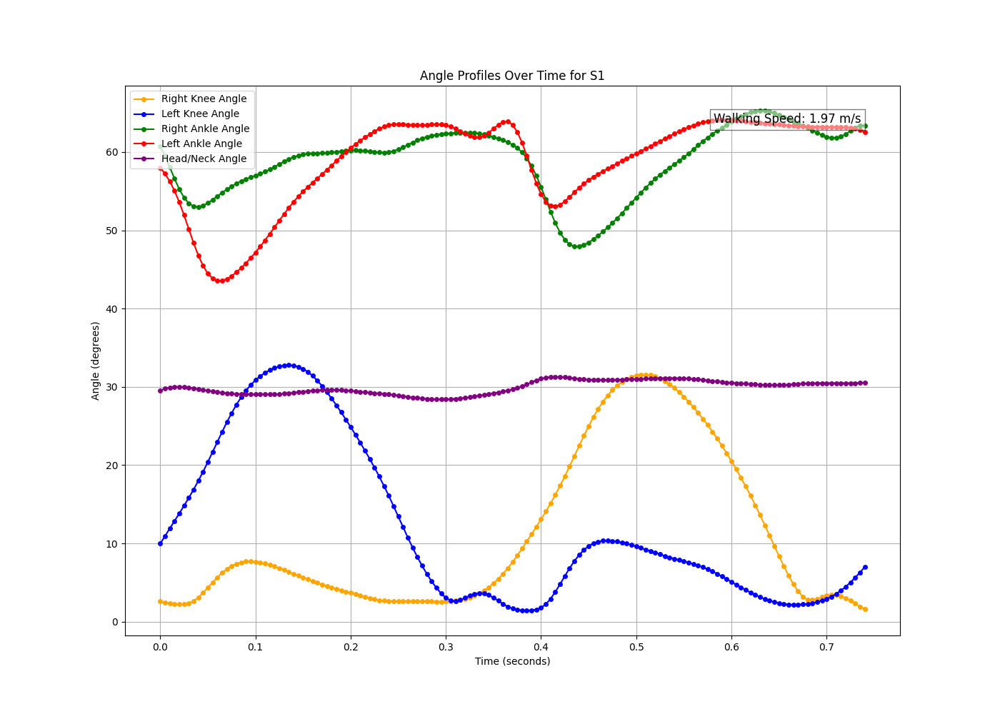

# Motion Capture Data Analysis

This project processes motion capture data from an Excel file, calculates biomechanical angles and walking speed, visualizes these metrics over time, and converts the data into a `.mat` file format.



## Features

- **Excel to .mat Conversion**: Converts Excel motion capture data into a `.mat` file for seamless integration with MATLAB and other tools.
- **Data Extraction**: Extracts marker names, numerical data, and time data from Excel sheets.
- **Data Structuring**: Organizes data into a structured format and saves it in a `.mat` file.
- **Calculations**: Computes walking speed and biomechanical angles (knee, ankle, head/neck) from marker data.
- **Visualization**: Plots these metrics over time and saves plots as images.

## Dependencies

- Python 3.x
- Pandas
- Numpy
- Matplotlib
- Scipy
- Mat4py
- OS

## Installation

Ensure you have Python 3 and the necessary libraries installed:

```bash
pip install pandas numpy matplotlib scipy mat4py
```

## Usage

1. **Prepare your Excel file**: Save your motion capture data in `motiondata.xlsx`.

2. **Run the Code**: Execute the script in a Python environment.

```bash
python script.py
```

3. **Outputs**:
   - The structured data is saved as `motioncapture_with_time.mat`.
   - Plots are saved in the `/plots` directory.

## Functions

- **extract_clean_data_with_time(sheet_data)**: Extracts and cleans data from Excel sheets.
- **calculate_distance(p1, p2)**: Computes Euclidean distance between two points.
- **calculate_angle_between_points(p1, p2, p3)**: Calculates the angle formed by three points.
- **calculate_walking_speed(start, end, final_time)**: Computes walking speed given start and end positions over time.

## Plot Example

The included plot showcases angles of different body parts over time for each sheet in the Excel file, annotated with the calculated walking speed.

## Author

Vu Anh Minh Le

---

